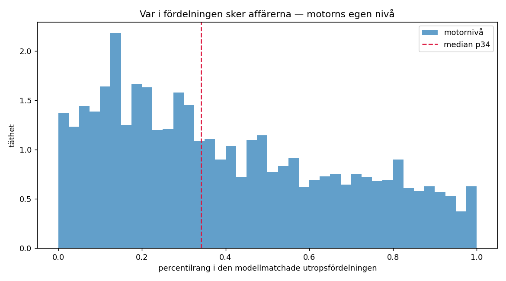
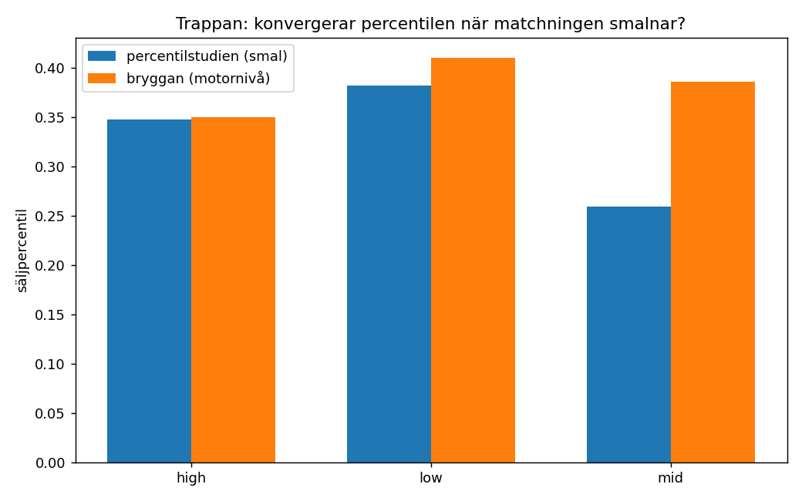
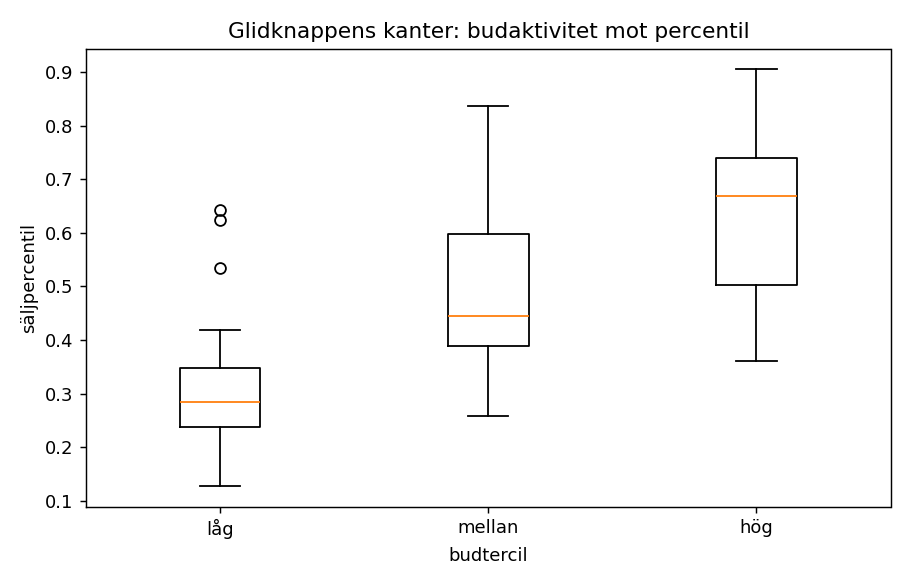

# Del A — bryggmätningen: säljpercentilen på motorns egen nivå

## Sammanfattning

Percentilstudien mätte rangen mot en bred jämförelsemängd (median ~11 800 annonser). Den här mätningen gör om det på **motorns egen fråga**: samma märke OCH modellnamn, ingen fallback-breddning. 4,703 försäljningar kvalificerade, medianjämförelsemängd **98 annonser** — produktionens storleksordning.

**Säljpercentilen på motornivå är p34** (okorrigerad p37, n=4,369).

### Trappan — konvergerar percentilen när matchningen smalnar?

| segment | bred nivå | smal nivå | motornivå | n (motornivå) |
|---|---|---|---|---|
| high | p61 | p35 | **p35** | 3,220 |
| low | p61 | p38 | **p41** | 486 |
| mid | p61 | p26 | **p39** | 387 |
| **alla** | p61 | p34 | **p34** | 4,369 |

Den breda nivån är percentilstudiens globala värde, den smala dess märke+möbeltyp-matchning, motornivån den här mätningen. Driver värdet fortfarande i samma riktning vid varje nivåbyte är det inte konvergens utan en trend — och då är ingen av nivåerna slutgiltig.

### Kanalgapet på motornivå

| märkesklass | gap här | gap i percentilstudien | grupper | n Tradera |
|---|---|---|---|---|
| low | -0.211 | -0.421 | 2 | 72 |
| mid | -0.133 | -0.079 | 1 | 36 |
| high | — | -0.092 | 0 | 0 |

Låg-end: `gap_measured`. Gapet är omskattat på motornivåns ranger, aldrig ärvt från den breda nivån.

**high saknar mätbart gap på den här nivån** — modellkravet lämnar för få Tradera-försäljningar kvar för att para ihop källorna inom samma möbeltyp. Segmentens värden för high är därför OKORRIGERADE, alltså rå auktionsdata. De ska läsas som en övre gräns: den verkliga konsumentmarknadsnivån ligger sannolikt lägre.

### Glidknappens kanter — budterciler

Första gången intervallets kanter får datastöd.

**Uppdraget antog att hög budaktivitet skulle ge LÄGRE rang och därmed vara kandidat för vänsterkanten. Datan säger tvärtom.** Hög-tercilen ligger konsekvent HÖGRE än låg-tercilen, i varje segment med underlag.

Tolkningen blir därmed den omvända, och den är mer intuitiv: ett objekt som drar många budgivare är efterfrågat och klarar ett högt pris. Ett objekt som knappt får bud måste ned i pris för att gå alls. Översatt till glidknappen är det alltså **låg-tercilen som är vänsterkanten** (priset som säljer även utan konkurrens) och **hög-tercilen som är högerkanten** (priset som kräver att någon verkligen vill ha just din möbel).

| segment | låg tercil | mellan | hög tercil | n |
|---|---|---|---|---|
| bord · high | p13 | p34 | p49 | 213 |
| bord · low | p23 | p47 | p74 | 102 |
| byrå · low | p53 | p69 | p70 | 154 |
| fotpall · high | p31 | p46 | p56 | 550 |
| fåtölj · high | p21 | p31 | p36 | 1,197 |
| fåtölj · low | p13 | p26 | p42 | 52 |
| high | p25 | p37 | p46 | 3,220 |
| high · hög | p20 | p30 | p38 | 1,208 |
| high · låg | p34 | p42 | p56 | 845 |
| high · mellan | p24 | p38 | p51 | 1,167 |
| hylla · high | p29 | p40 | p65 | 53 |
| hylla · low | p64 | p84 | p90 | 100 |
| hylla · mid | p28 | p57 | p74 | 329 |
| low | p42 | p62 | p76 | 486 |
| low · hög | p62 | p78 | p83 | 149 |
| low · låg | p29 | p40 | p67 | 215 |
| low · mellan | p36 | p62 | p79 | 122 |
| matgrupp · high | p23 | p43 | p71 | 93 |
| mid | p28 | p52 | p72 | 387 |
| mid · låg | p26 | p48 | p77 | 130 |
| mid · mellan | p28 | p64 | p69 | 213 |
| soffa · high | p36 | p44 | p64 | 156 |
| stol · high | p30 | p41 | p50 | 943 |

### Gjorde bilden någon skillnad?

Bild fanns för **11.3 %** av försäljningarna (533 st). Auctionets `image_url` är ifylld på 181 787 av 461 564 rader, och efter modellkravet återstår så här få.

Där bilden fanns behöll omsorteringen i median 100 % av jämförelsemängden, och ändrade rangen med i median 0.000. Andel där jämförelsemängden ändrades väsentligt (under 90 % överlapp): **13.5 %**.

Metoder: {'none': 4170, 'too_few_vectors': 459, 'filtered': 46, 'reverted': 27, 'loosened': 1}.

**Detta betyder att 'motornivån' här i praktiken är textnivå.** Bildomsorteringen är en del av produktionens pipeline som den här mätningen bara kan tala om för en liten minoritet av försäljningarna. Siffran ovan är alltså motorns nivå vad gäller SÖKBREDD, men inte vad gäller bildfiltrering.

---

## Bortfallstratt

| steg | tradera | auctionet | totalt |
|---|---|---|---|
| slutpriser i datan | 7,831 | 461,564 | 469,395 |
| auktionskanal (ej fastpris) | 7,714 | 461,564 | 469,278 |
| är en möbel (ej okänd/del) | 4,420 | 386,760 | 391,180 |
| har datum och budantal | 4,420 | 386,760 | 391,180 |
| med igenkänt märke | 897 | 69,102 | 69,999 |
| med igenkänt märke OCH modellnamn | 224 | 19,585 | 19,809 |
| modellsökning gav >= 20 annonser | 196 | 4,507 | 4,703 |

## Segment och grupper

| segment | dimension | säljpercentil | okorr. | 95 % CI | n | ≥bud | median n annonser |
|---|---|---|---|---|---|---|---|
| bord · high | möbeltyp × märkesklass | **p29** | p29 | p20–p38 | 213 | ≥5 | 92 |
| bord · low | möbeltyp × märkesklass | **p28** | p49 | p16–p38 | 102 | ≥5 | 316 |
| byrå · low | möbeltyp × märkesklass | **p44** | p62 | p39–p48 | 154 | ≥5 | 346 |
| fotpall · high | möbeltyp × märkesklass | **p44** | p44 | p38–p48 | 550 | ≥5 | 70 |
| fåtölj · high | möbeltyp × märkesklass | **p28** | p28 | p26–p29 | 1,197 | ≥5 | 68 |
| fåtölj · low | möbeltyp × märkesklass | **p12** | p29 | p3–p21 | 52 | ≥5 | 305 |
| high | märkesklass | **p35** | p35 | p34–p36 | 3,220 | ≥5 | 74 |
| high · hög | märkesklass × prisnivå | **p28** | p28 | p26–p31 | 1,208 | ≥5 | 48 |
| high · låg | märkesklass × prisnivå | **p43** | p43 | p41–p46 | 845 | ≥5 | 80 |
| high · mellan | märkesklass × prisnivå | **p36** | p36 | p33–p38 | 1,167 | ≥5 | 136 |
| hylla · high | möbeltyp × märkesklass | **p42** | p42 | p32–p49 | 53 | ≥5 | 193 |
| hylla · low | möbeltyp × märkesklass | **p62** | p82 | p58–p66 | 100 | ≥5 | 316 |
| hylla · mid | möbeltyp × märkesklass | **p41** | p53 | p34–p50 | 329 | ≥5 | 1359 |
| low | märkesklass | **p41** | p58 | p36–p45 | 486 | ≥5 | 316 |
| low · hög | märkesklass × prisnivå | **p53** | p74 | p45–p58 | 149 | ≥5 | 1009 |
| low · låg | märkesklass × prisnivå | **p29** | p45 | p21–p36 | 215 | ≥5 | 294 |
| low · mellan | märkesklass × prisnivå | **p42** | p62 | p31–p46 | 122 | ≥5 | 316 |
| matgrupp · high | möbeltyp × märkesklass | **p45** | p45 | p34–p52 | 93 | ≥5 | 46 |
| mid | märkesklass | **p39** | p52 | p31–p46 | 387 | ≥5 | 1359 |
| mid · låg | märkesklass × prisnivå | **p35** | p48 | p28–p49 | 130 | ≥5 | 1359 |
| mid · mellan | märkesklass × prisnivå | **p42** | p55 | p34–p51 | 213 | ≥5 | 458 |
| soffa · high | möbeltyp × märkesklass | **p48** | p48 | p38–p57 | 156 | ≥5 | 51 |
| stol · high | möbeltyp × märkesklass | **p41** | p41 | p38–p42 | 943 | ≥5 | 92 |

## Beslut fattade under körningen

**Modellnamn kräver att märket också står i texten.** "Kivik" är både en IKEA-soffa och en ort, "Stockholm" både en IKEA-serie och en stad. Modellnamnet räknas därför bara när märket finns i samma annonstext. Det kostar träffar men är enda sättet att undvika att jämförelsemängden fylls med fel möbel.

**Bildfiltret får inte göra jämförelsemängden för tunn.** Skär bildomsorteringen bort så mycket att färre än 20 annonser återstår används textnivåns mängd i stället, och raden märks `reverted`. Alternativet vore att mäta mot en handfull annonser, vilket ger en rang men ingen mätning.

**Kanalgapet omskattas, ärvs aldrig.** Hela poängen med Del A är att nivåbytet ändrar rangen. Att då återanvända ett gap skattat på den breda nivån vore att importera just det fel vi försöker mäta bort.

**Endast 533 av de kvalificerade försäljningarna hade bild.** Auctionets `image_url` saknas på 60 % av raderna. Alla 533 embeddades (153 ms/bild, under två minuter totalt), men andelen är för låg för att bildomsorteringen ska prägla resultatet. Det redovisas öppet i stället för att döljas — se ärlighetssektionen.

## Ärlighetssektion

**Urvalet lutar mot design och premium.** Modellnamn står i auktionstitlar när möbeln är känd nog att namnges. En Lamino heter Lamino; en IKEA-soffa på Blocket heter "soffa". Resultatet gäller därför det segmentet. **Low end täcks inte av Del A** — dess sanning ska komma från Del B:s omlistningskedjor.

**Auktionsbilder är studiofoton, Blocket-bilder är vardagsrumsfoton.** DINOv2 mäter visuell identitet, och en professionellt ljussatt bild mot vit bakgrund liknar inte nödvändigtvis samma möbel fotograferad i ett vardagsrum. Bildomsorteringen kan därför bete sig annorlunda här än i produktion, där både fråga och annonser kommer från samma sorts källa.

**Auktion är fortfarande inte privataffär.** Kanalgapet korrigerar för skillnaden mellan Tradera och Auctionet, inte för skillnaden mellan auktion och Blocket. Den sista överföringen är fortfarande ett antagande.

**Ingen såld/osåld-signal.** Som tidigare: datan innehåller bara sålda objekt. Mätningen säger var affärer sker, aldrig var de uteblir.

## Figurer

