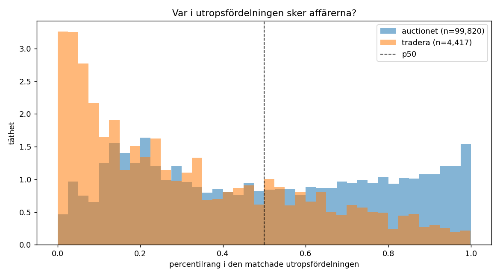
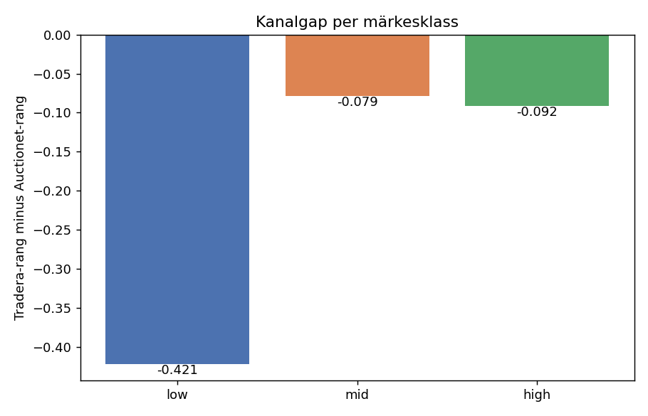
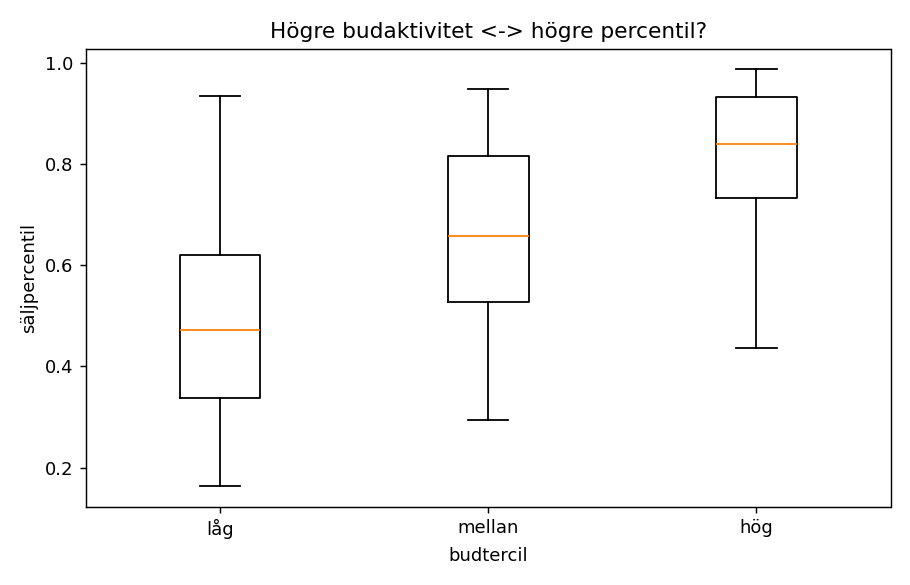
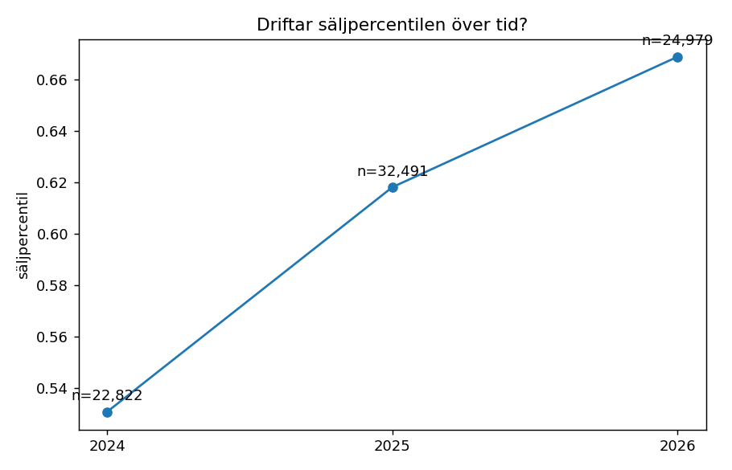

# Percentilstudie — vilken percentil av utropspriserna säljer?

## Sammanfattning

Studien mäter var i utropsprisfördelningen affärer faktiskt sker, med 104,237 auktionsförsäljningar matchade mot samtida utropsannonser (±3 mån).

### 1. De tio största grupperna

| spår | grupp | säljpercentil | 95 % CI | n | budtröskel | källa |
|---|---|---|---|---|---|---|
| B | hylla · mellan | **p42** | p41–p43 | 4,244 | ≥5 | auctionet_corrected |
| B | bord · mellan | **p36** | p34–p37 | 4,164 | ≥5 | auctionet_corrected |
| B | byrå · låg | **p41** | p30–p46 | 3,674 | ≥5 | tradera |
| B | fåtölj · mellan | **p24** | p21–p26 | 3,460 | ≥5 | auctionet_corrected |
| B | bord · hög | **p37** | p35–p39 | 3,258 | ≥5 | auctionet_corrected |
| A | fåtölj · high · hög | **p33** | p31–p34 | 3,068 | ≥5 | auctionet_corrected |
| B | bord · låg | **p27** | p25–p32 | 3,007 | ≥5 | tradera |
| B | byrå · hög | **p40** | p36–p40 | 3,001 | ≥5 | auctionet_corrected |
| B | hylla · hög | **p43** | p42–p44 | 2,779 | ≥5 | auctionet_corrected |
| B | hylla · låg | **p45** | p41–p52 | 2,743 | ≥5 | tradera |

### 2. Huvudfrågan: vilken percentil ska motorn föreslå?

**Svaret motorn ska använda är p34**, mätt på de 13,125 försäljningar som kunde matchas SMALT — på märke och möbeltyp. Det är den enda matchningsnivån som liknar produktionens fråga, och därmed den enda vars percentil kan överföras rakt av. Motorns nuvarande default är medelvärdet av p40 och p50, alltså cirka p45.

| segment | säljpercentil | okorrigerad | p25–p75 | n |
|---|---|---|---|---|
| high | **p35** | p44 | p14–p59 | 7,695 |
| low | **p38** | p78 | p13–p53 | 3,235 |
| mid | **p26** | p33 | p8–p54 | 2,195 |

Kolumnen *okorrigerad* är auktionsdatan rå. Skillnaden mot den korrigerade är kanalgapet, och den är störst för low end — auktionerad IKEA är samlarvintage medan utropsannonserna är vardagsmöbler. Att de tre klasserna konvergerar EFTER korrigering är ett tecken på att gapet fångar en verklig kanaleffekt och inte bara brus.

De breda gruppvärdena (tabellen ovan) ligger på **p38** i median, spann p24–p45.

Den globala säljpercentilen över allt kvalificerat underlag är p61. Att den ligger klart högre än gruppvärdena är ingen motsägelse utan två effekter: den är okorrigerad för kanalgapet, och den domineras av Auctionet som står för 96 % av försäljningarna. Gruppvärdena är kanalkorrigerade mot Tradera, som ligger lägre.

### 3. Kanalgapet per märkesklass

| märkesklass | gap (Tradera − Auctionet) | grupper | n Tradera |
|---|---|---|---|
| low | -0.421 | 6 | 440 |
| mid | -0.079 | 2 | 147 |
| high | -0.092 | 2 | 72 |

Låg-end: `gap_measured`.

Rått, utan gruppkontroll, ligger Tradera på p24 och Auctionet på p49 — men den skillnaden blandar ihop kanal och sortiment, och är därför inte kanalgapet. Tabellen ovan jämför bara inom samma möbeltyp och märkesklass.

### 4. De tre största förbehållen

**Percentilen är uppmätt mot en BREDARE fördelning än motorn använder.** Studien matchar mest på möbeltyp och tid (median 11,790 annonser per jämförelse), medan motorn matchar på märke och modell (~100 annonser). 
Testat på 15,197 försäljningar där båda nivåerna fanns: medianrangen är p43 smalt mot p67 brett, medianavvikelsen 0.149 och korrelationen 0.73. 38 % av försäljningarna hamnar inom 10 percentilenheter i båda.

**Auktion är inte privatförsäljning.** Percentilerna överförs till Blocket-världen som ett antagande. För budgetsegmentet är auktionsdata en krycka oavsett korrektion — den riktiga sanningskällan för low end är framtida Blocket-signaler (omlistningskedjor, snapshots). Studien levererar design och premium med hög trovärdighet och low end med tydligt märkta förbehåll.

**Ingen såld/osåld-signal finns.** Datan innehåller bara sålda objekt: Auctionet har noll rader med noll bud, och Traderas noll-budsrader är fastprisköp, inte misslyckade auktioner. Studien kan säga var affärer sker, aldrig var de uteblir.

---

## Bortfallstratt

| steg | tradera | auctionet | totalt |
|---|---|---|---|
| slutpriser i datan | 7,831 | 461,564 | 469,395 |
| auktionskanal (ej fastpris) | 7,714 | 461,564 | 469,278 |
| är en möbel (ej okänd/del) | 4,420 | 386,760 | 391,180 |
| har datum och budantal | 4,420 | 386,760 | 391,180 |
| matchad mot >= 30 samtida utrop | 4,417 | 99,820 | 104,237 |
|   ... och >= 5 bud | 1,814 | 67,178 | 68,992 |
|   ... och >= 4 bud | 1,983 | 71,974 | 73,957 |
|   ... och >= 3 bud | 2,251 | 78,041 | 80,292 |

## Metod

**Sök först, mät sen.** För varje försäljning hämtas de utropsannonser som var aktuella ±3 månader kring försäljningsdatumet, via motorns egen `find_listings`. Percentilrangen är andelen av dem som låg under slutpriset.

**Cirkelbrytaren.** Prisnivån (låg/mellan/hög) sätts av medianen i den MATCHADE UTROPSFÖRDELNINGEN, aldrig av objektets slutpris. Gruppen klassas alltså på vad marknaden begär för liknande möbler — samma information motorn har vid förfrågan — och mäts på vad som faktiskt betalades.

**Budspärr.** Endast försäljningar med budkonkurrens räknas; ett ensamt bud är en likvidation, inte prisupptäckt. Startkrav ≥5 bud, nedtrappat per grupp till 4 och 3 när gruppen har färre än 50 kvalificerade försäljningar. Aldrig under 3. Vald tröskel loggas per grupp.

**Två spår.** Spår A bär märkesklassen och gäller de försäljningar där ett märke eller en upphovsman går att läsa ur texten. Spår B är de omärkta och rapporteras som möbeltyp × prisnivå UTAN märkesdimension — ingen prisbaserad märkesklassning exporteras.

### Känslighet för budtröskeln

| grupp | ≥3 | ≥4 | ≥5 | n≥3 | n≥5 |
|---|---|---|---|---|---|
| fåtölj · high · hög | p40 | p41 | p42 | 3,264 | 3,068 |
| stol · high · hög | p49 | p50 | p51 | 1,926 | 1,802 |
| bord · high · hög | p58 | p62 | p63 | 1,170 | 1,064 |
| soffa · mid · låg | p34 | p35 | p38 | 834 | 715 |
| fåtölj · high · låg | p83 | p84 | p85 | 847 | 777 |
| fåtölj · low · låg | p80 | p81 | p84 | 650 | 570 |
| stol · high · låg | p83 | p83 | p83 | 692 | 649 |
| fotpall · high · hög | p55 | p56 | p56 | 677 | 645 |

## Validering (fas 3)

Holdout 50/50 på försäljningsnivå, 40,146 träning / 40,146 test. Felen räknas i logdomän — priser är multiplikativa, så en dubbling ska väga lika tungt som en halvering.

| modell | medianfel | inom ±25 % | systematiskt fel | n |
|---|---|---|---|---|
| gruppspecifik säljpercentil | 109.5 % | 15.8 % | +4.5 % | 40,146 |
| baslinje: global säljpercentil | 116.1 % | 15.0 % | +2.7 % | 40,146 |
| baslinje: alltid p50 | 118.2 % | 16.4 % | -27.8 % | 40,146 |
| baslinje: aux_estimate | 61.4 % | 26.2 % | +33.3 % | 38,986 |

Bara 25.1 % av testraderna hade en gruppspecifik percentil; resten föll tillbaka på den globala, vilket späder ut jämförelsen. Samma tabell begränsad till de rader där gruppvärdet faktiskt fanns:

| modell | medianfel | inom ±25 % | n |
|---|---|---|---|
| gruppspecifik säljpercentil | 106.6 % | 17.5 % | 10,071 |
| baslinje: global säljpercentil | 138.4 % | 14.3 % | 10,071 |
| baslinje: alltid p50 | 144.4 % | 15.0 % | 10,071 |
| baslinje: aux_estimate | 51.8 % | 30.4 % | 9,865 |

#### Tolkning — läs den här innan siffrorna används

**Gruppindelningen bär, men knappt.** Den gruppspecifika percentilen slår den globala med 6.6 procentenheter i medianfel (109.5 % mot 116.1 %). Mot alltid-p50 är marginalen 8.7 procentenheter — men på måttet *andel inom ±25 %* är alltid-p50 faktiskt något BÄTTRE (16.4 % mot 15.8 %). Specen bad mig skriva rakt ut om gruppindelningen är brus: den är det inte, men den är nära. Vinsten är för liten för att motivera en finmaskig gruppstruktur i motorn.

**Ingen av modellerna predikterar ett enskilt slutpris väl.** Medianfelet ligger runt 110 % för alla percentilbaserade modeller. Det är väntat och inte ett underkännande av studien: att veta VAR i fördelningen affärer sker säger inget om vilket enskilt objekt som är dyrt eller billigt inom den fördelningen. Auktionshusets egen värdering (61 % fel) är bättre just för att den är objektspecifik — den har sett föremålet.

`aux_estimate` är en **känt partisk** prediktor — 74 % av objekten klubbas under värderingen och mediankvoten är 0,62 — så att slå den är ingen bedrift. Huvudbaslinjerna är alltid-p50 och den globala säljpercentilen.

### Rekommenderade percentiler per segment (smal matchning)

Detta är studiens användbara leverans till motorn: percentiler mätta mot samma sorts fördelning som motorn själv bygger.

| märkesklass × prisnivå | säljpercentil | p25–p75 | n |
|---|---|---|---|
| high · hög | **p35** | p14–p59 | 7,402 |
| high · låg | **p32** | p6–p63 | 67 |
| high · mellan | **p42** | p20–p66 | 226 |
| low · hög | **p9** | p0–p31 | 84 |
| low · låg | **p39** | p15–p53 | 2,614 |
| low · mellan | **p36** | p0–p52 | 537 |
| mid · hög | **p30** | p13–p57 | 897 |
| mid · låg | **p25** | p5–p53 | 819 |
| mid · mellan | **p20** | p3–p48 | 479 |

### Stabilitet över tid

| år | säljpercentil | n |
|---|---|---|
| 2024 | p53 | 22,822 |
| 2025 | p62 | 32,491 |
| 2026 | p67 | 24,979 |

Tidsöverlappet mot utropsdatan medger 2024–2026, inte Auctionets 15 år: 70 % av auktionsraderna saknar samtida utropspriser att räkna en rang mot.

## Resultat per grupp

Spår A: 45 grupper med exporterbart värde. Spår B: 30. Märkta `insufficient_market`: 0.

### Spår A — möbeltyp × märkesklass × prisnivå

| grupp | status | säljpercentil | 95 % CI | p25–p75 | n | ≥bud | källa |
|---|---|---|---|---|---|---|---|
| bord · high · hög | ok | **p54** | p49–p58 | p30–p91 | 1,064 | ≥5 | auctionet_corrected |
| bord · high · låg | ok | **p82** | p81–p84 | p79–p97 | 438 | ≥5 | auctionet_corrected |
| bord · high · mellan | ok | **p80** | p79–p82 | p78–p97 | 278 | ≥5 | auctionet_corrected |
| bord · low · hög | `insufficient_data` | — | — | — | 13 | ≥3 | — |
| bord · low · låg | ok | **p37** | p24–p61 | p20–p70 | 344 | ≥5 | tradera |
| bord · low · mellan | ok | **p36** | p27–p43 | p51–p96 | 119 | ≥5 | auctionet_corrected |
| bord · mid · hög | ok | **p44** | p33–p55 | p29–p76 | 102 | ≥5 | auctionet_corrected |
| bord · mid · låg | `insufficient_data` | — | — | — | 27 | ≥3 | — |
| bord · mid · mellan | `insufficient_data` | — | — | — | 21 | ≥3 | — |
| byrå · high · hög | ok | **p75** | p64–p80 | p54–p97 | 241 | ≥5 | auctionet_corrected |
| byrå · high · låg | ok | **p87** | p86–p88 | p86–p99 | 222 | ≥5 | auctionet_corrected |
| byrå · high · mellan | ok | **p64** | p54–p83 | p50–p96 | 53 | ≥3 | auctionet_corrected |
| byrå · low · hög | `insufficient_data` | — | — | — | 3 | ≥3 | — |
| byrå · low · låg | ok | **p48** | p31–p58 | p19–p58 | 310 | ≥5 | tradera |
| byrå · low · mellan | ok | **p48** | p45–p51 | p77–p97 | 110 | ≥5 | auctionet_corrected |
| byrå · mid · hög | ok | **p36** | p31–p41 | p25–p63 | 79 | ≥5 | auctionet_corrected |
| byrå · mid · låg | `insufficient_data` | — | — | — | 40 | ≥3 | — |
| byrå · mid · mellan | `insufficient_data` | — | — | — | 3 | ≥3 | — |
| bäddsoffa · high · hög | `insufficient_data` | — | — | — | 5 | ≥3 | — |
| bäddsoffa · high · mellan | `insufficient_data` | — | — | — | 4 | ≥3 | — |
| bäddsoffa · low · hög | `insufficient_data` | — | — | — | 3 | ≥3 | — |
| bäddsoffa · low · låg | `insufficient_data` | — | — | — | 7 | ≥3 | — |
| bäddsoffa · mid · hög | `insufficient_data` | — | — | — | 3 | ≥3 | — |
| bäddsoffa · mid · låg | `insufficient_data` | — | — | — | 1 | ≥3 | — |
| bäddsoffa · mid · mellan | `insufficient_data` | — | — | — | 0 | ≥3 | — |
| fotpall · high · hög | ok | **p47** | p44–p51 | p32–p80 | 645 | ≥5 | auctionet_corrected |
| fotpall · high · låg | ok | **p84** | p81–p85 | p83–p96 | 246 | ≥5 | auctionet_corrected |
| fotpall · high · mellan | ok | **p81** | p79–p83 | p79–p95 | 237 | ≥5 | auctionet_corrected |
| fotpall · low · hög | `insufficient_data` | — | — | — | 2 | ≥3 | — |
| fotpall · low · låg | ok | **p25** | p18–p34 | p45–p87 | 129 | ≥5 | auctionet_corrected |
| fotpall · low · mellan | `insufficient_data` | — | — | — | 18 | ≥3 | — |
| fotpall · mid · hög | `insufficient_data` | — | — | — | 31 | ≥3 | — |
| fotpall · mid · låg | `insufficient_data` | — | — | — | 13 | ≥3 | — |
| fotpall · mid · mellan | `insufficient_data` | — | — | — | 22 | ≥3 | — |
| fåtölj · high · hög | ok | **p33** | p31–p34 | p22–p61 | 3,068 | ≥5 | auctionet_corrected |
| fåtölj · high · låg | ok | **p76** | p74–p77 | p67–p96 | 777 | ≥5 | auctionet_corrected |
| fåtölj · high · mellan | ok | **p71** | p69–p73 | p57–p93 | 520 | ≥5 | auctionet_corrected |
| fåtölj · low · hög | `insufficient_data` | — | — | — | 26 | ≥3 | — |
| fåtölj · low · låg | ok | **p42** | p39–p44 | p65–p95 | 570 | ≥5 | auctionet_corrected |
| fåtölj · low · mellan | `insufficient_data` | — | — | — | 2 | ≥3 | — |
| fåtölj · mid · hög | `insufficient_data` | — | — | — | 31 | ≥3 | — |
| fåtölj · mid · låg | `insufficient_data` | — | — | — | 49 | ≥3 | — |
| fåtölj · mid · mellan | ok | **p35** | p30–p44 | p31–p60 | 51 | ≥4 | auctionet_corrected |
| hylla · high · hög | ok | **p54** | p53–p59 | p40–p84 | 463 | ≥5 | auctionet_corrected |
| hylla · high · låg | ok | **p82** | p80–p83 | p84–p96 | 244 | ≥5 | auctionet_corrected |
| hylla · high · mellan | ok | **p82** | p79–p84 | p82–p97 | 229 | ≥5 | auctionet_corrected |
| hylla · low · hög | `insufficient_data` | — | — | — | 6 | ≥3 | — |
| hylla · low · låg | ok | **p39** | p33–p60 | p26–p69 | 362 | ≥5 | tradera |
| hylla · low · mellan | ok | **p47** | p44–p50 | p79–p96 | 103 | ≥5 | auctionet_corrected |
| hylla · mid · hög | ok | **p45** | p38–p50 | p29–p79 | 382 | ≥5 | auctionet_corrected |
| hylla · mid · låg | `insufficient_data` | — | — | — | 25 | ≥3 | — |
| hylla · mid · mellan | `insufficient_data` | — | — | — | 14 | ≥3 | — |
| hörnsoffa · high · hög | `insufficient_data` | — | — | — | 5 | ≥3 | — |
| hörnsoffa · high · låg | `insufficient_data` | — | — | — | 3 | ≥3 | — |
| hörnsoffa · high · mellan | `insufficient_data` | — | — | — | 3 | ≥3 | — |
| hörnsoffa · low · hög | `insufficient_data` | — | — | — | 0 | ≥3 | — |
| hörnsoffa · low · låg | `insufficient_data` | — | — | — | 13 | ≥3 | — |
| hörnsoffa · low · mellan | `insufficient_data` | — | — | — | 1 | ≥3 | — |
| hörnsoffa · mid · hög | `insufficient_data` | — | — | — | 9 | ≥3 | — |
| hörnsoffa · mid · låg | `insufficient_data` | — | — | — | 2 | ≥3 | — |
| hörnsoffa · mid · mellan | `insufficient_data` | — | — | — | 2 | ≥3 | — |
| matgrupp · high · hög | ok | **p55** | p52–p59 | p39–p79 | 441 | ≥5 | auctionet_corrected |
| matgrupp · high · låg | ok | **p82** | p78–p84 | p75–p98 | 234 | ≥5 | auctionet_corrected |
| matgrupp · high · mellan | ok | **p81** | p79–p83 | p80–p96 | 183 | ≥5 | auctionet_corrected |
| matgrupp · low · hög | `insufficient_data` | — | — | — | 1 | ≥3 | — |
| matgrupp · low · låg | ok | **p42** | p37–p48 | p62–p94 | 132 | ≥5 | auctionet_corrected |
| matgrupp · low · mellan | `insufficient_data` | — | — | — | 22 | ≥3 | — |
| matgrupp · mid · hög | ok | **p33** | p23–p44 | p23–p57 | 53 | ≥3 | auctionet_corrected |
| matgrupp · mid · låg | `insufficient_data` | — | — | — | 20 | ≥3 | — |
| matgrupp · mid · mellan | `insufficient_data` | — | — | — | 13 | ≥3 | — |
| soffa · high · hög | ok | **p43** | p40–p47 | p33–p78 | 530 | ≥5 | auctionet_corrected |
| soffa · high · låg | ok | **p64** | p61–p69 | p50–p93 | 328 | ≥5 | auctionet_corrected |
| soffa · high · mellan | ok | **p60** | p56–p67 | p39–p92 | 437 | ≥5 | auctionet_corrected |
| soffa · low · hög | `insufficient_data` | — | — | — | 18 | ≥3 | — |
| soffa · low · låg | ok | **p36** | p24–p42 | p45–p93 | 115 | ≥5 | auctionet_corrected |
| soffa · low · mellan | `insufficient_data` | — | — | — | 1 | ≥3 | — |
| soffa · mid · hög | ok | **p35** | p21–p39 | p20–p64 | 87 | ≥5 | auctionet_corrected |
| soffa · mid · låg | ok | **p20** | p9–p23 | p6–p27 | 715 | ≥5 | tradera |
| soffa · mid · mellan | ok | **p26** | p24–p31 | p17–p58 | 401 | ≥5 | auctionet_corrected |
| spegel · high · hög | `insufficient_data` | — | — | — | 8 | ≥3 | — |
| spegel · high · låg | `insufficient_data` | — | — | — | 5 | ≥3 | — |
| spegel · high · mellan | `insufficient_data` | — | — | — | 2 | ≥3 | — |
| spegel · low · hög | `insufficient_data` | — | — | — | 1 | ≥3 | — |
| spegel · low · låg | `insufficient_data` | — | — | — | 10 | ≥3 | — |
| spegel · low · mellan | `insufficient_data` | — | — | — | 0 | ≥3 | — |
| spegel · mid · hög | `insufficient_data` | — | — | — | 1 | ≥3 | — |
| spegel · mid · låg | `insufficient_data` | — | — | — | 5 | ≥3 | — |
| stol · high · hög | ok | **p41** | p39–p44 | p30–p77 | 1,802 | ≥5 | auctionet_corrected |
| stol · high · låg | ok | **p74** | p73–p77 | p67–p92 | 649 | ≥5 | auctionet_corrected |
| stol · high · mellan | ok | **p62** | p56–p66 | p50–p86 | 164 | ≥5 | auctionet_corrected |
| stol · low · hög | `insufficient_data` | — | — | — | 5 | ≥3 | — |
| stol · low · låg | ok | **p29** | p26–p35 | p46–p88 | 249 | ≥5 | auctionet_corrected |
| stol · low · mellan | ok | **p23** | p8–p35 | p29–p88 | 97 | ≥5 | auctionet_corrected |
| stol · mid · hög | ok | **p24** | p20–p31 | p18–p51 | 108 | ≥5 | auctionet_corrected |
| stol · mid · låg | `insufficient_data` | — | — | — | 19 | ≥3 | — |
| stol · mid · mellan | `insufficient_data` | — | — | — | 2 | ≥3 | — |
| säng · high · hög | `insufficient_data` | — | — | — | 39 | ≥3 | — |
| säng · high · låg | `insufficient_data` | — | — | — | 18 | ≥3 | — |
| säng · high · mellan | `insufficient_data` | — | — | — | 26 | ≥3 | — |
| säng · low · hög | `insufficient_data` | — | — | — | 15 | ≥3 | — |
| säng · low · låg | `insufficient_data` | — | — | — | 13 | ≥3 | — |
| säng · low · mellan | `insufficient_data` | — | — | — | 6 | ≥3 | — |
| säng · mid · hög | `insufficient_data` | — | — | — | 5 | ≥3 | — |
| säng · mid · mellan | `insufficient_data` | — | — | — | 2 | ≥3 | — |

### Spår B — möbeltyp × prisnivå (omärkta)

| grupp | status | säljpercentil | 95 % CI | p25–p75 | n | ≥bud | källa |
|---|---|---|---|---|---|---|---|
| bord · hög | ok | **p37** | p35–p39 | p39–p78 | 3,258 | ≥5 | auctionet_corrected |
| bord · låg | ok | **p27** | p25–p32 | p14–p49 | 3,007 | ≥5 | tradera |
| bord · mellan | ok | **p36** | p34–p37 | p48–p85 | 4,164 | ≥5 | auctionet_corrected |
| byrå · hög | ok | **p40** | p36–p40 | p36–p84 | 3,001 | ≥5 | auctionet_corrected |
| byrå · låg | ok | **p41** | p30–p46 | p19–p63 | 3,674 | ≥5 | tradera |
| byrå · mellan | ok | **p38** | p37–p39 | p49–p89 | 2,530 | ≥5 | auctionet_corrected |
| bäddsoffa · hög | `insufficient_data` | — | — | — | 12 | ≥3 | — |
| bäddsoffa · mellan | `insufficient_data` | — | — | — | 43 | ≥3 | — |
| fotpall · hög | ok | **p38** | p33–p41 | p39–p80 | 541 | ≥5 | auctionet_corrected |
| fotpall · låg | ok | **p47** | p35–p58 | p18–p65 | 464 | ≥5 | tradera |
| fotpall · mellan | ok | **p38** | p34–p40 | p51–p85 | 999 | ≥5 | auctionet_corrected |
| fåtölj · låg | ok | **p34** | p19–p38 | p12–p58 | 2,394 | ≥5 | tradera |
| fåtölj · mellan | ok | **p24** | p21–p26 | p35–p76 | 3,460 | ≥5 | auctionet_corrected |
| hylla · hög | ok | **p43** | p42–p44 | p46–p81 | 2,779 | ≥5 | auctionet_corrected |
| hylla · låg | ok | **p45** | p41–p52 | p21–p63 | 2,743 | ≥5 | tradera |
| hylla · mellan | ok | **p42** | p41–p43 | p59–p88 | 4,244 | ≥5 | auctionet_corrected |
| hörnsoffa · hög | `insufficient_data` | — | — | — | 58 | ≥3 | — |
| hörnsoffa · låg | `insufficient_data` | — | — | — | 48 | ≥3 | — |
| hörnsoffa · mellan | ok | **p6** | p0–p22 | p17–p69 | 61 | ≥5 | auctionet_corrected |
| matgrupp · hög | ok | **p33** | p32–p35 | p39–p73 | 1,108 | ≥5 | auctionet_corrected |
| matgrupp · låg | ok | **p19** | p18–p22 | p53–p86 | 1,389 | ≥5 | auctionet_corrected |
| matgrupp · mellan | ok | **p15** | p7–p27 | p5–p35 | 1,219 | ≥5 | tradera |
| soffa · hög | ok | **p16** | p15–p22 | p21–p66 | 751 | ≥5 | auctionet_corrected |
| soffa · låg | ok | **p23** | p18–p33 | p10–p41 | 739 | ≥5 | tradera |
| soffa · mellan | ok | **p15** | p10–p19 | p24–p73 | 1,183 | ≥5 | auctionet_corrected |
| spegel · hög | ok | **p29** | p24–p36 | p32–p71 | 159 | ≥5 | auctionet_corrected |
| spegel · låg | ok | **p35** | p33–p40 | p69–p93 | 138 | ≥5 | auctionet_corrected |
| spegel · mellan | ok | **p38** | p32–p45 | p59–p87 | 85 | ≥5 | auctionet_corrected |
| stol · hög | ok | **p31** | p29–p34 | p31–p75 | 1,684 | ≥5 | auctionet_corrected |
| stol · låg | ok | **p45** | p38–p54 | p24–p60 | 2,297 | ≥5 | tradera |
| stol · mellan | ok | **p25** | p23–p27 | p36–p78 | 1,857 | ≥5 | auctionet_corrected |
| säng · hög | ok | **p19** | p13–p27 | p22–p67 | 83 | ≥5 | auctionet_corrected |
| säng · låg | ok | **p32** | p19–p39 | p6–p50 | 70 | ≥5 | tradera |
| säng · mellan | ok | **p23** | p15–p30 | p30–p80 | 103 | ≥5 | auctionet_corrected |

## Beslut fattade under körningen

**Frågan konstrueras ur märke och möbeltyp, inte ur modellnamn.** Motorn får i produktion `märke + modellnamn` av användaren. En auktionsförsäljning har ingen sådan fråga — titeln är en fri beskrivning ("FÅTÖLJ, 'Pernilla', Bruno Mathsson") och ett token-AND på hela titeln ger noll träffar. Frågan byggs därför av det som går att läsa ut säkert: igenkänt märke eller upphovsman, plus möbeltyp. Uppmjukningsordningen är motorns egen: märke+typ → typ → typ inkl. omärkt typ → alla möbler. Konsekvensen mäts i smalhetskänsligheten och redovisas som förbehåll 1.

**Månadsupplösning på tidsfönstret.** Fönstret räknas från försäljningsmånadens början i stället för det exakta datumet, vilket gör matchningen memoiserbar: två försäljningar av samma typ samma månad matchar per definition mot samma annonser. Det gör hela underlaget körbart i stället för ett urval — ingen sampling behövdes. Kanten flyttas som mest 31 dagar av ~180.

**Dubbletter i utropspoolen kollapsas på titel och pris.** 31,7 % av utropsannonserna ligger i en grupp med identisk normaliserad titel och identiskt pris, den största med 492 exemplar. Utan kollaps kan en enda omlistad annons dominera fördelningen den mäts mot. 1 043 270 → 772 811 rader.

**Traderas fastprisrader utesluts ur auktionsanalysen.** 141 Tradera-rader har `channel = marketplace_fixed`: fastprisköp med per definition noll bud. De kan aldrig passera budspärren och är inte misslyckade auktioner. De utesluts ur analysen och rapporteras separat — de är samtidigt det närmaste datan kommer en ren konsumenttransaktion, och därmed intressanta för framtida arbete.

**Noll-budsanalysen struken.** Ordern bad mig kontrollera om Traderas osålda objekt har ett utropspris. Svaret är att det inte finns några osålda objekt: Auctionet har noll rader med noll bud (minsta budantal är 1) och Traderas noll-budsrader är fastprisköp utan `aux_estimate`. Den empiriska "för dyrt"-gränsen kräver framtida snapshot-data.

**Prisnivåterciler räknas på rang, inte på kvantilkanter.** Den matchade medianen klumpar hårt — samma sökning ger samma median för hundratals försäljningar — så kvantilkanter kollapsar till samma värde och delningen misslyckas. Rangbaserade terciler delar alltid i tre.

**Utökad märkesigenkänning genomförs inte nu.** Väg (c) från fas 0-rapporten är noterad som framtida körning. Med nuvarande lista klassas cirka en femtedel av möbelförsäljningarna på märke; resten går till spår B.

## Ärlighetssektion

**Auktion är inte privataffär.** Percentilerna överförs till Blocket-världen som ett antagande. Kanalgapet Tradera–Auctionet är delvis ett mått på hur stort det antagandet är, och det redovisas öppet per märkesklass.

**Låg-end är svagast underbyggt.** Budkonkurrensen faller monotont med märkesklass — median 15 bud för high end, 9 för low. En tunn auktionspublik för budgetmöbler betyder att auktionsdata för det segmentet är en krycka oavsett korrektion. Låg-end ärver aldrig mid-gapet: värdet extrapoleras med trenden och märks `gap_extrapolated`, eller exporteras som `insufficient_market`. Ett underkorrigerat värde ser ut som ett svar och används som ett — det är farligare än inget värde.

**Cirkulär risk är undanröjd men värd att kontrollera.** Prisnivån sätts av den matchade utropsfördelningens median, inte av slutpriset. Ingen grupp klassas alltså på samma tal den utvärderas mot. Spår B saknar helt märkesdimension, så ingen prisbaserad märkesklassning exporteras.

**Tradera-fönstret är inte en månad.** Tidigare rapporterat som ett fönster på en månad. Det berodde på en bugg: `sold_at` blandar två ISO-format och pandas tystade 7 816 av 7 831 datum till NaT. Efter fixen spänner Tradera 2021-03 till 2026-07. Säsongsförbehållet gäller alltså inte i den formen.

## Figurer

