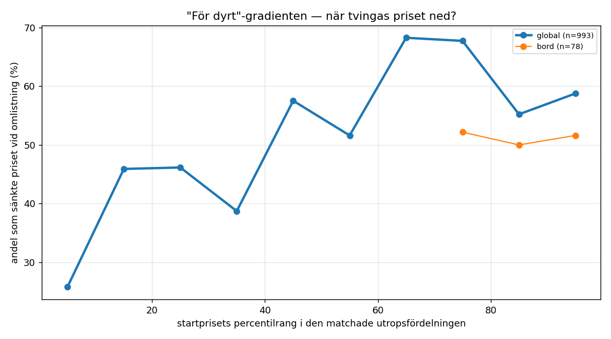
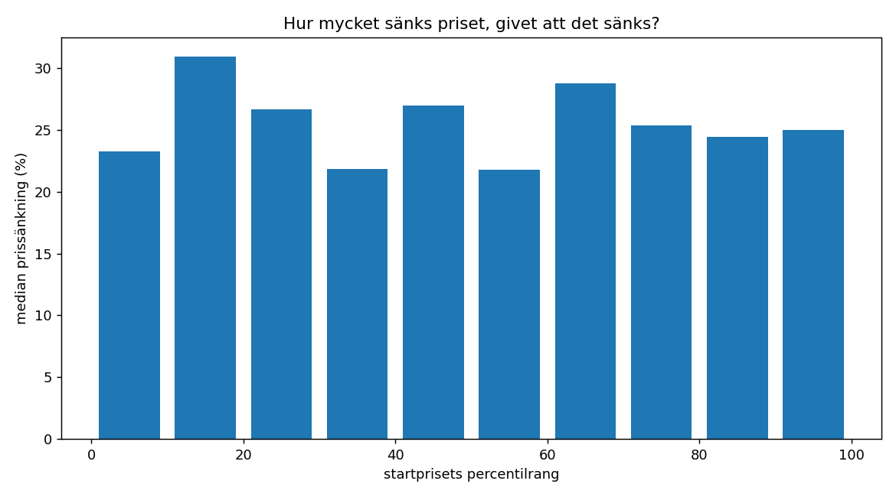

# Del B — omlistningskedjor: den empiriska "för dyrt"-gradienten

## Sammanfattning

Auktionsspåret innehåller noll osålda objekt, så gränsen för "för dyrt" måste komma ur Blockets egen data. Varje omlistning med sänkt pris är en dom över det första priset.

**993 kedjor** överlevde skärpningen, av 30,944 kandidater — 96.8 % offrades för precisionens skull.

**Gradienten finns.** Bland kedjor vars startpris låg i den lägsta rangdecilen sänkte 26 % priset vid omlistning; i den högsta gjorde 59 % det. 
Det är den empiriska signalen om att ett för högt startpris tvingas ned — och den är den enda i hela projektet som kommer från Blocket-världen själv.

**Men precisionen räcker inte för produktion.** Skattad precision efter skärpning: **0.74**, mot kravet ~0,90. Resultatet är därför märkt `indicative_only` och ska inte kopplas in i motorn.

---

## Skärpningen — vad den kostade

Precisionen skattas ur utfallets symmetri: brus antas ge lika många prishöjningar som prissänkningar, så andelen höjda gånger två är brusets storlek. En äkta omlistningspopulation ska luta kraftigt mot sänkt pris.

| steg | kedjor | sänkt % | höjt % | skattad precision |
|---|---|---|---|---|
| kandidatkedjor (samma titel, olika datum) | 30,944 | 44.6 | 44.7 | 0.106 |
| titeln förekommer högst 2 gånger | 10,026 | 52.2 | 33.3 | 0.335 |
| titeln minst 40 tecken | 1,057 | 53.6 | 14.6 | 0.709 |
| prisändringen rimlig | 1,047 | 53.9 | 14.0 | 0.719 |
| bilden motbevisar inte | 993 | 54.6 | 13.0 | 0.74 |

Titelns **sällsynthet och längd** är de starkaste hävstängerna. En rubrik som förekommer 11–50 gånger ger sänkt/höjt-kvot 0,58 — alltså FLER höjningar än sänkningar, vilket är omöjligt för äkta omlistningar och bevisar att sådana rubriker fångar olika möbler. Vid frekvens 2 och minst 40 tecken vänder kvoten till 4,2.

Den programmatiska granskningen av 100 slumpade kedjor ger 82 % säkra före skärpningen och 99 % efter. **Den andra siffran är cirkulär och ska ignoreras** — granskningen prövar samma tre kriterier (titel, bild, pris) som redan användes som filter, så den kan inte annat än godkänna det som passerat dem. Symmetriskattningen ovan är det enda oberoende måttet, och den ger 0.74.

Även den är optimistisk av ett andra skäl: 99 av de 100 granskade saknade bild på båda länkarna och kunde alltså inte motbevisas oavsett metod.

## Varför bildkontrollen inte räddar situationen

Bland titelmatchade kedjor där båda länkarna har en embeddad bild är medianen för lägsta parvisa likhet **0,45**. De flesta titelmatchningar visar alltså olika möbler. Bara 3,7 % når 0,90.

Problemet är att bilden bara finns för en liten minoritet: 95 % av kedjorna har ingen embeddad bild på båda länkarna, och för dem finns ingen oberoende kontroll alls. Bildkontrollen kan därför förkasta, men inte bekräfta i skala.

## "För dyrt"-gradienten

| startrang | n | sänkte priset | höjde | median sänkning |
|---|---|---|---|---|
| p0-10 | 66 | 25.8 % | 16.7 % | -23.3 % |
| p10-20 | 61 | 45.9 % | 16.4 % | -30.9 % |
| p20-30 | 65 | 46.2 % | 13.9 % | -26.7 % |
| p30-40 | 62 | 38.7 % | 22.6 % | -21.8 % |
| p40-50 | 73 | 57.5 % | 17.8 % | -26.9 % |
| p50-60 | 93 | 51.6 % | 16.1 % | -21.8 % |
| p60-70 | 104 | 68.3 % | 14.4 % | -28.8 % |
| p70-80 | 124 | 67.7 % | 10.5 % | -25.4 % |
| p80-90 | 134 | 55.2 % | 6.0 % | -24.4 % |
| p90-100 | 211 | 58.8 % | 10.0 % | -25.0 % |

### Prisnivå: hög

| startrang | n | sänkte priset | median sänkning |
|---|---|---|---|
| p30-40 | 20 | 45.0 % | -25.0 % |
| p40-50 | 25 | 60.0 % | -21.4 % |
| p60-70 | 24 | 45.8 % | -20.0 % |
| p70-80 | 28 | 67.9 % | -25.0 % |
| p80-90 | 32 | 62.5 % | -24.4 % |
| p90-100 | 68 | 58.8 % | -28.8 % |

### Prisnivå: låg

| startrang | n | sänkte priset | median sänkning |
|---|---|---|---|
| p50-60 | 25 | 44.0 % | -23.5 % |
| p70-80 | 30 | 53.3 % | -31.9 % |
| p80-90 | 20 | 50.0 % | -34.6 % |
| p90-100 | 30 | 53.3 % | -16.7 % |

### Prisnivå: mellan

| startrang | n | sänkte priset | median sänkning |
|---|---|---|---|
| p0-10 | 29 | 34.5 % | -21.4 % |
| p10-20 | 33 | 51.5 % | -28.6 % |
| p20-30 | 28 | 53.6 % | -29.9 % |
| p30-40 | 23 | 43.5 % | -19.4 % |
| p40-50 | 34 | 52.9 % | -24.4 % |
| p50-60 | 40 | 57.5 % | -20.0 % |
| p60-70 | 44 | 79.5 % | -28.8 % |
| p70-80 | 51 | 70.6 % | -25.8 % |
| p80-90 | 59 | 47.5 % | -21.1 % |
| p90-100 | 86 | 62.8 % | -22.0 % |

## Jämförelse med Del A

Del A mätte säljpercentilen till **p34** på auktionsdata. Om den siffran är rätt bör omlistningar bli vanliga någonstans ovanför den — ett pris satt klart över den nivå där affärer sker borde tvingas ned.

Sänkningarna passerar 50 % först i decilen **p40-50**. 
Pekar de två signalerna åt samma håll är det en korsvalidering mellan två helt olika datakällor — auktionsutfall och Blockets omlistningar.

## Ärlighetssektion

**En kedja som tar slut betyder inte att möbeln såldes.** Säljaren kan ha gett upp, tröttnat, skänkt bort möbeln eller flyttat. Den sista länken är inte en försäljning, den är bara den sista observationen. Inga slutsatser i den här rapporten bygger på att kedjan tog slut.

**En annons utan senare länk kan vara en missad matchning.** Ändrar säljaren rubriken vid omlistningen bryts kedjan, och annonsen ser ut som en engångsföreteelse. Kedjeidentifieringen är alltså partisk mot säljare som skriver om sina annonser — sannolikt just de mest aktiva, alltså de vars beteende vi helst vill mäta.

**Inga påståenden om säljtid.** Datan är fortfarande en rad per annons utan livslängd. Avståndet mellan två länkar är tiden mellan två OBSERVATIONER, inte tiden annonsen låg ute. Del C finns för att den skillnaden ska försvinna.

**Precisionen når inte kravet.** Skärpningen tog kvoten sänkt/höjt från 1,0 till 4,2, men skattad precision stannar under 0,90. Resultatet är riktningsgivande, inte kalibrerande, och exporteras som `indicative_only`.

**Gradienten kan delvis vara regression mot medelvärdet.** En annons vars startpris råkade hamna högt i fördelningen har mer utrymme att sänkas än en som redan låg lågt — helt oberoende av om marknaden sa nej. Effektens storlek går inte att separera med den här datan, och gradientens lutning ska därför läsas som en övre gräns.

## Figurer

